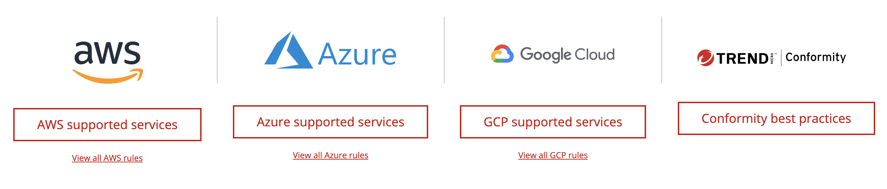

# Conformity Knowledge Base
Along with better visibility, compliance and faster remediation for your cloud infrastructure, Conformity also has a growing public library of 750+ cloud infrastructure configuration best practices for your AWS™, Microsoft® Azure, and Google Cloud™ environments. Providing simple, step-by-step resolutions to rectify any security vulnerabilities, performance, cost inefficiencies, and reliability risks. This catalogue of cloud guardrails is a core part of Conformity which automatically monitors and auto-remediates cloud infrastructure.

Below are the cloud, services and their associated best practice rules with clear instructions on how to perform the updates – made either through the console or via the Command Line Interface (CLI).
- AWS supported services
- Azure supported services
- GCP supported services
 

## Conformity Knowledge Base:
A Conformity Knowledge Base, in the context of cloud computing, is a repository of information and guidelines specifically focused on ensuring that your cloud infrastructure is configured and managed in accordance with best practices. This resource provides valuable insights into how to optimize your cloud environment for performance, security, and compliance.

This Knowledge Base typically covers a wide range of topics, including but not limited to:

- Security Best Practices: Guidelines on configuring security settings, implementing encryption, managing access controls, and safeguarding against potential threats.

- Performance Optimization: Recommendations for optimizing the performance of your cloud resources, such as selecting appropriate instance types, configuring load balancing, and tuning network settings.

- Cost Management: Strategies for cost-effective cloud usage, including tips on resource allocation, monitoring usage patterns, and utilizing cost-effective services.

- Compliance Standards: Information on adhering to industry-specific regulations and compliance standards, ensuring that your cloud infrastructure meets the necessary legal and regulatory requirements.

- Troubleshooting and Issue Resolution: Guides to identify and resolve common issues that may arise in your cloud environment.

Having a Conformity Knowledge Base at your disposal is beneficial for both beginners (like yourself) and experienced professionals, as it provides a structured and comprehensive resource to navigate the complexities of cloud infrastructure management while ensuring adherence to best practices. It acts as a guide to help users make informed decisions and maintain a secure and well-optimized cloud environment.

